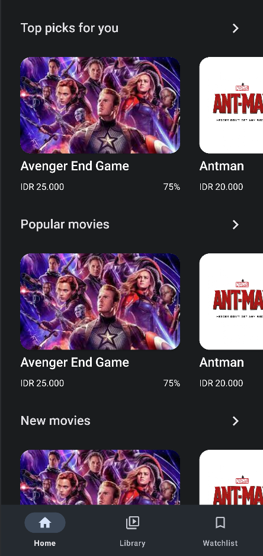
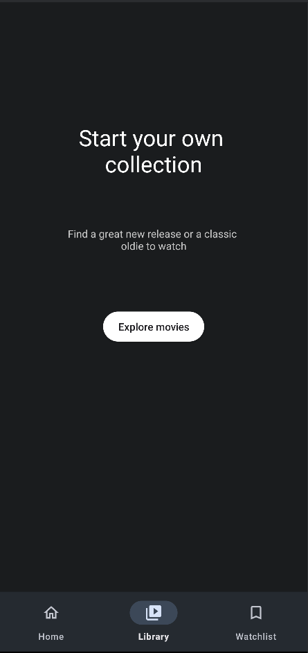
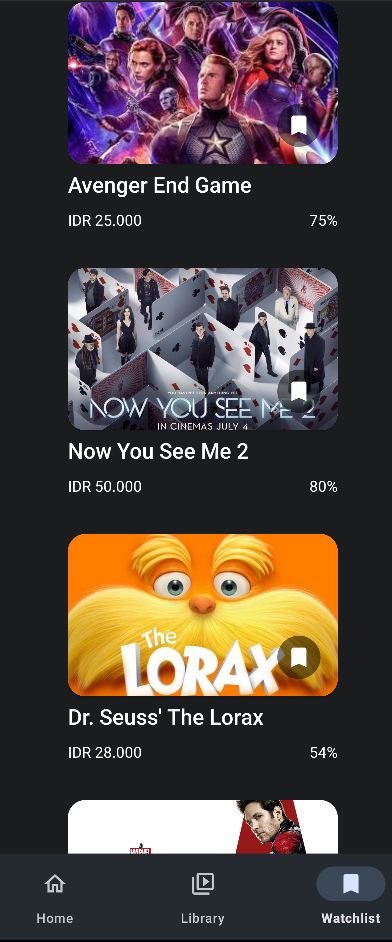

# TUGAS GOOGLE DSC CLONE APLIKASI INTERFACE
#### oleh: Adiel Boanerge Gananputra
#### NIM: 22/500051/SV/21386

### Deskripsi
Google TV merupakan aplikasi yang dibuat oleh Google untuk menonton film. Aplikasi ini menyediakan penyewaan film dan pembelian film serta menghubungkannya ke dalam Smart TV.
Repository ini berisikan kode interface dan beberapa file kotlin yang tidak terpakai untuk membuat cloning interface aplikasi Google TV.

### Cara menjalankan
1. Buka Android Studio
2. Get Project from version control (masukkan link dibawah ke dalam URL) atau clone repository ini di directory yang diinginkan
```URI
https://github.com/ergegananputra/google_dsc_clone_google_movie.git
```
4. Buka folder repository ini dengan Android Studio
5. Setting emulator dengan compiler API 34 di build.gradle.kts (Module: app)
```kotlin
    // ...

    android {
        namespace = "com.latihanbyrg.googlemoviewclone"
        compileSdk = 34

        defaultConfig {
            applicationId = "com.latihanbyrg.googlemoviewclone"
            minSdk = 24
            targetSdk = 33
            versionCode = 1
            versionName = "1.0"

            testInstrumentationRunner = "androidx.test.runner.AndroidJUnitRunner"
        }
        
        // ...
    }
```
4. Sync gradle, pastikan terhubung ke internet
5. Jalankan emulator
6. Run 'app'

### Screenshot dan Penjelasan
- Halaman Utama
    - 
    - Pada gambar diatas, merupakan halaman utama yang menampilkan 3 section, yaitu top picks, popular, dan new movies. Mendapatkan section-section tersebut dapat dilakukan dengan cara scrolling ke bawah. Untuk melihat list film di setiap section, dapat dilakukan scrolling ke kanan atau kiri.

- Halaman Library
    - 
    - Pada gambar diatas, merupakan halmaan library yang menampilkan teks untuk menambahkan library. Di dalam interface tersebut terdapat sebuah button yang berada di tengah.

- Halaman Watchlist
    - 
    - Pada gambar diatas, merupakan halaman watchlist yang merupakan bagian dimana watchlist akan disimpan dalam bentuk scroll view vertical, untuk menghapus akan digunakan memencet tombol icon bookmark_outline
- Bottom Navigation Bar
    - Bottom navigation akan tertampil di setiap halaman utama, yaitu Halaman utama, halaman library, dan halaman watchlist. Bottom Navigation Bar ini di set up di dalam file kotlin MainActivity.kt
### Catatan
Repository ini merupakan project yang tidak memiliki button yang dapat digunakan kecuali bottom navigation bar. Semua button dan card film yang ada di dalam repository ini hanya merupakan interface belaka.
Icon-icon yang berada dalam repository ini bersumber dari https://fonts.google.com/icons.
Gambar-gambar yang berada dalam repository ini bersumber dari internet bebas.
